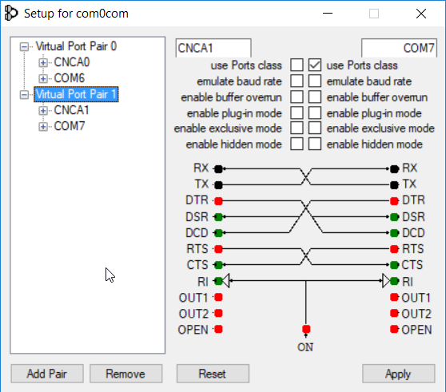

# Ammeter module documentation
Module handling extracting voltage and current of batteries connected to pichawk via mavlink.
## Requirements
- Computer with Windows
- Installed Mission Planner, Python3 and git
## Installation
1. Download com0com binary (https://sourceforge.net/projects/com0com/)
2. Install com0com. Select CNCA0 <-> CNCB0 and COM# <-> COM# components.
3. Run com0com and create 2 viratual COM-CNC ports pairs. 

4. Download hub4com binary (https://drive.google.com/file/d/1Tu9aX4mCEOHgi2uEXvhgcwaqeJsB-Luq/view?usp=sharing)
5Create python virtual environment and then install required libraries
```commandline
pip install -r requirements.txt
```
## Using module
#### Setting up package splitter
From command prompt go to folder containing hub4com.exe adn run:
```commandline
hub4com.exe --octs=off --baud=<baudRate> \\.\COM12 \\.\CNCA0 \\.\CNCA1
```
\<baudRate> - replace with baud rate, typically 57600<br/>
COM12 - port to which pixhawk antenna is connected<br/>
CNCA0, CNCA1 - virtual ports created during installation<br/>
Remember to plug in antenna before running this command!
#### Setting up mission planner
Run Mission Planner and connect it to COM port from first virtual port pair used in hub4com command.
#### Running script
In command prompt go to folder with your virtual environment and then its Script folder. Run activate.bat to activate 
python's virtual environment. In this environment go to folder containing cloned repository and run:
```commandline
python main.py --port COM14
```
where COM14 is second virtual prot pair used in hub4com command.